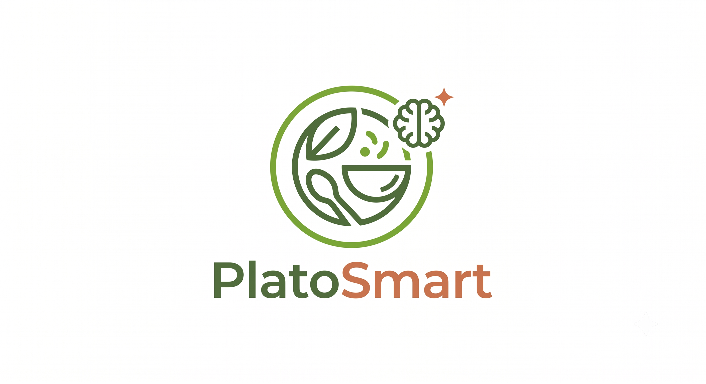

<p align="center">
  
</p>

<p align="center">
  A modern recipe platform built with Next.js and Strapi.
</p>

<p align="center">
  
  
  
  
  
</p>

---

## Overview

PlatoSmart is a full-stack recipe discovery platform. Users can browse recipes by category, search by title or ingredients, follow authors, and save their favorite dishes. Content is managed through a headless Strapi CMS and rendered with a Next.js App Router frontend.

## Tech Stack

| Layer | Technology |
|---|---|
| Frontend | Next.js 16 (App Router, Turbopack), React 19, TypeScript |
| Styling | Tailwind CSS, shadcn/ui, Radix UI |
| CMS | Strapi 5 |
| Database | PostgreSQL |
| Package Manager | pnpm |
| Containerization | Docker, Docker Compose |
| Tunneling / Edge | Cloudflare Tunnel |

## Project Structure

```
PlatoSmart/
├── app/                  # App Router pages
│   ├── about/
│   ├── authors/
│   │   └── [slug]/
│   ├── categories/
│   │   └── [slug]/
│   ├── contact/
│   ├── privacy/
│   ├── recipes/
│   │   └── [slug]/
│   ├── saved/
│   ├── terms/
│   ├── layout.tsx
│   ├── page.tsx
│   ├── robots.ts
│   └── sitemap.ts
├── api/                  # Strapi API client layer
├── components/            # UI components (incl. shadcn/ui)
├── hooks/                  # Custom React hooks
├── lib/                     # Core utilities (Strapi client, etc.)
├── types/                    # Shared TypeScript types
├── utils/                     # Formatting & media helpers
├── public/                     # Static assets
├── Dockerfile
└── next.config.mjs
```

## Features

- 🍽️ Browse recipes by category, author, or search
- ⭐ Save favorite recipes (client-side)
- 📱 Fully responsive, accessible UI (Radix + shadcn/ui)
- 🖼️ Optimized image delivery via Next.js Image + Strapi media library
- 🔎 SEO-ready: dynamic metadata, sitemap, robots.txt
- 🔄 Incremental Static Regeneration for fresh content without full rebuilds

## Getting Started

### Prerequisites

- Node.js 22+
- [pnpm](https://pnpm.io/)
- Docker (optional, for production-style builds)
- A running [Strapi](https://strapi.io/) instance (see `NEXT_PUBLIC_STRAPI_URL`)

### Local Development

```bash
pnpm install
pnpm dev
```

The app will be available at `http://localhost:3000`.

### Production Build

```bash
pnpm build
pnpm start
```

### Docker

Build and run the production image:

```bash
docker build -t platosmart-next .
docker run -d -p 3000:3000 --name platosmart-next platosmart-next
```

A `Makefile` is included with shortcuts for common tasks:

```bash
make dev         # Start the dev server
make build       # Build the Docker image
make up          # Build + run the production container
make down        # Stop and remove the container
make logs        # Tail container logs
make reinstall   # Clean install of dependencies
make help        # List all available commands
```

## Available Scripts

| Script | Description |
|---|---|
| `pnpm dev` | Start the development server |
| `pnpm build` | Create a production build |
| `pnpm start` | Run the production build locally |
| `pnpm lint` | Run ESLint |

## Environment Variables

Create a `.env` file in the project root (never committed to version control):

```bash
NEXT_PUBLIC_SITE_URL=https://app.platosmart.com
NEXT_PUBLIC_STRAPI_URL=https://strapi.platosmart.com
PORT=3000
```

## Deployment

This app is built as a multi-stage Docker image (`deps` → `builder` → `runner`) running on Node 22 Alpine, with pnpm managed via Corepack for reproducible installs. The homepage uses ISR (`revalidate`) to stay in sync with Strapi content without requiring a full rebuild on every content change.

## License

Private project — all rights reserved.